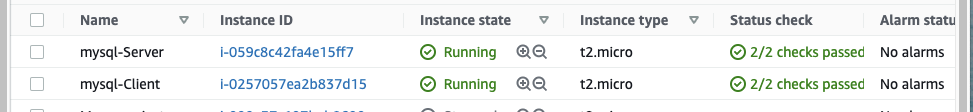

# CLIENT-SERVER ARCHITECTURE WITH MYSQL
---
In this task, I will demonstrate a basic Client-Server Relationship using mySQL Relational Database Management System.

1. The First step is to configure two Linux-based virtual servers(E2 instances in AWS).

2. On both servers, I installed mySQL and named them mysql-Client and mysql-Server.

